# GuildFi Assignment

Repository นี้เป็นส่วนหนึ่งของ GuildFi Assignment สำหรับ Job Interview

โดยเป็นการ Clone map ของเกม League of legends https://map.leagueoflegends.com/ โดยใช้ React, Three.js และ MetaMask (ในการทำ auth)

## How to run

project นี้ได้ใช้ react ในการพัฒนาโดยได้ใช้ boilerplate ของ create-react-app (typescript version)

### แบบ local development server

```
yarn install
yarn start
```

ไปที่ http://localhost:3000

### แบบ production build

```
yarn build
yarn global add serve
serve -s build
```

ไปที่ http://localhost:3000

### แบบ online deployment

สำหรับกรณีที่บนเครื่องไม่มี Node.js หรือไม่สามารถ run ตาม 2 แบบข้างต้นได้

project นี้ได้ทำการ deployed บน Vercel ไว้แล้ว

https://guildfi-assignment-fhiz6sqwb-iamsirid.vercel.app/

## Project Walkthrough

หน้าแรกจะพบกับส่วนของการ login ด้วย MetaMask
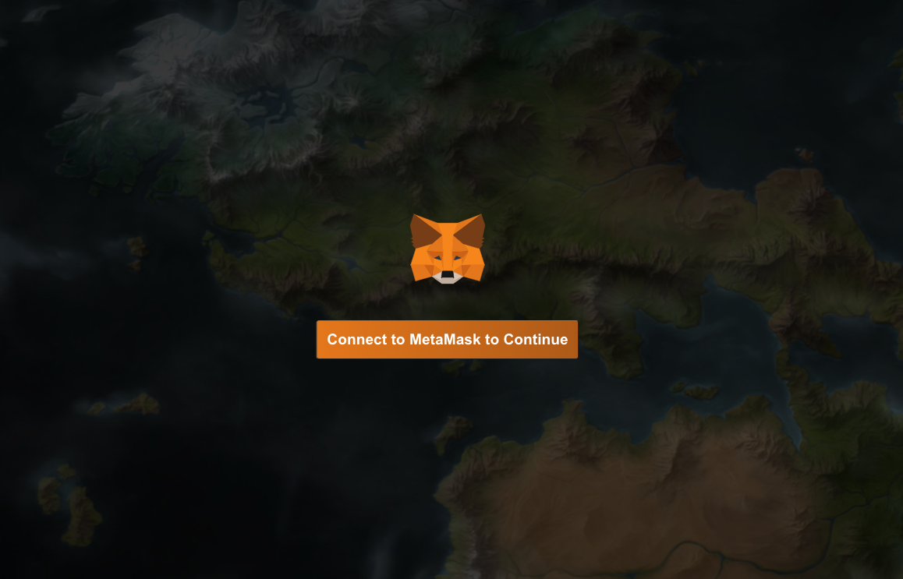

หลักการคือจะเก็บ state เป็น userAddress ของ user ไว้โดยได้มาจาการเช็ค ethereum account ของ user จาก MetaMask extension บน browser

App.tsx


ถ้า window.ethereum มีค่าแสดงว่ามี metamask extension บน browser

```
 if ((window as any).ethereum) {
   ...}
```

ทำการ request account มาและเก็บไว้ใน state

```
        const accounts = await (window as any).ethereum.request({
          method: 'eth_accounts',
        });

        if (accounts.length > 0) {
          setUserAddress(accounts[0]);
        }
      }
```

ส่วนของการ render เป็นการเช็คว่า state userAddress มีค่าหรือไม่ ถ้าไม่มีให้โชว์ Login component ถ้ามี ให้โชว์ Map component ซึ่งก็คือ component หลักของ Project นี้นั้นเอง

```
return userAddress ? (
    <Map />
  ) : (
    <Login
      login={async () => {
        ...
      }}
    />
  );
```

### Login component

ส่วนของ component สำหรับการ login (components/Login.tsx) จะแสดง ปุ่ม Login with MetaMask พร้อม css styling ด้วย @emotion/styled โดยหลักการตัว component จะรับ prop ฟังชั่น login มาแล้ว callback กลับไปเมื่อปุ่มถูกกด
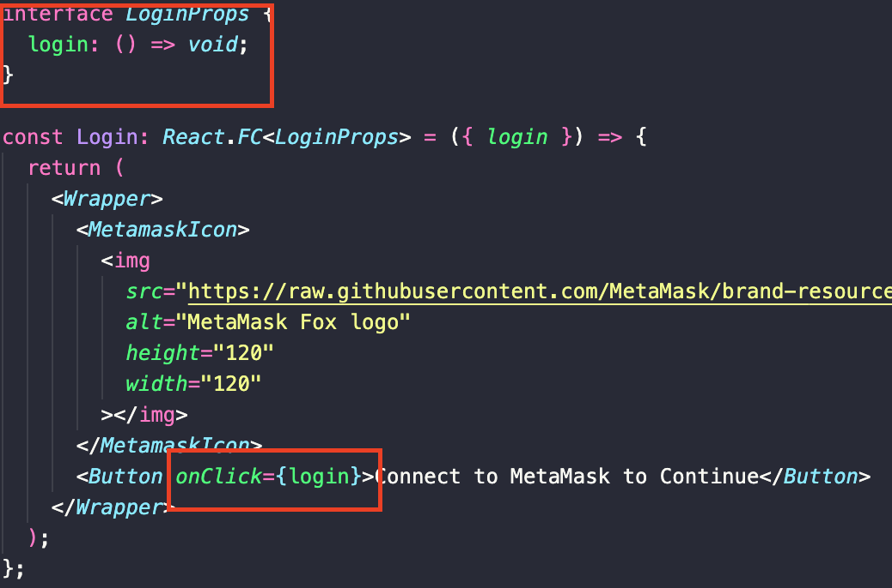

เพราะฉนั้น login จะไปอยู่ที่ parent (App.tsx)
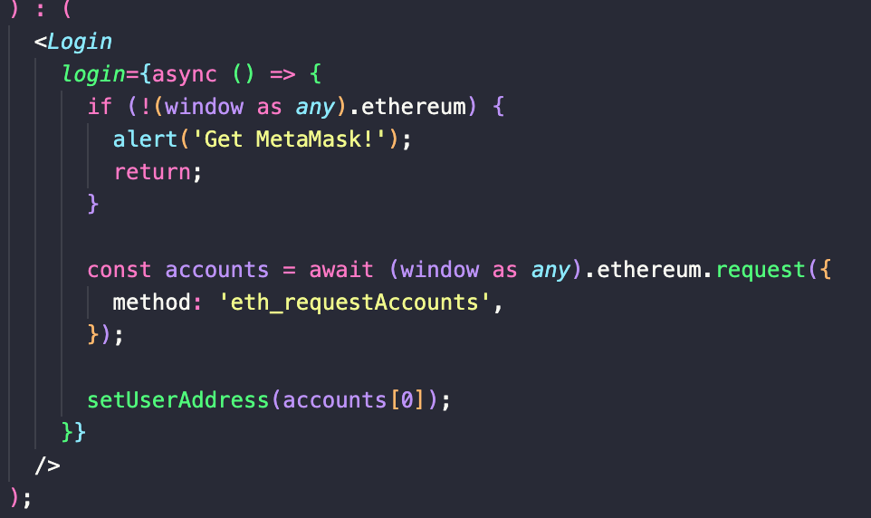

เช็คว่า browser มี MetaMask extension หรือไม่ ถ้าไม่ให่ alert แจ้งเตือนและ return ออก

```
        if (!(window as any).ethereum) {
          alert('Get MetaMask!');
          return;
        }
```

request account และ set userAddress state

```
        const accounts = await (window as any).ethereum.request({
          method: 'eth_requestAccounts',
        });

        setUserAddress(accounts[0]);
```

เมื่อผ่านขั้นตอนการ authen ด้วย MetaMask แล้ว component Map (components/Map.tsx) จะถูก render

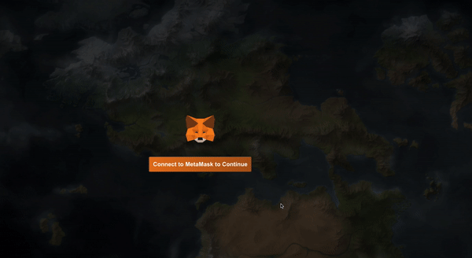

### Map component

component Map คือส่วนหลักของ Project นี้

โดย Map.tsx (components/Map.tsx)

จะแบ่งเป็น 3 ส่วนหลักๆคือ
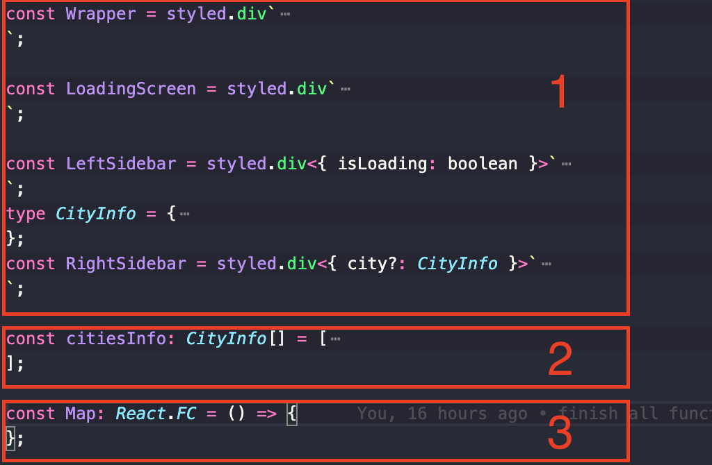

1. css styling for overlay JSX element

2. data ของ map

3. ตัว react component ที่จะ render

#### React component

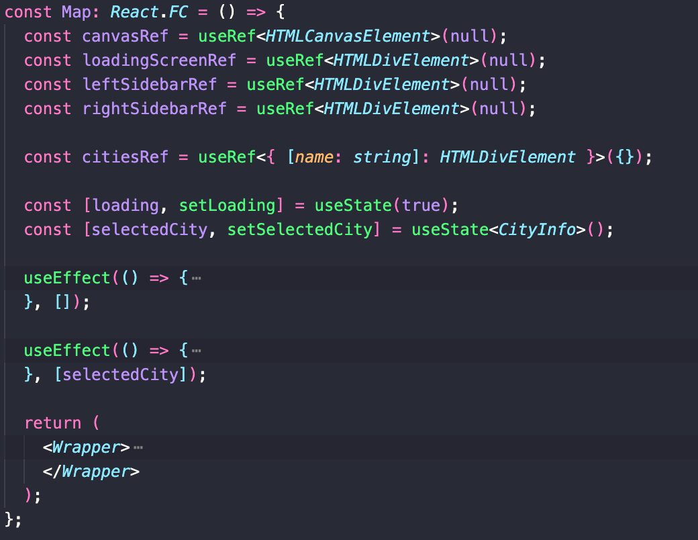

ส่วนของ react จะมีการใช้ hook อยู่ 3 ตัวคือ useRef, useState, useEffect,

useRef เป็น reference ไปยัง canvas ที่จะให้ Three.js วาด และ dom ที่จะ overlay อยู่บน 3D space (จะกล่าวรายละเอียดอีกที)
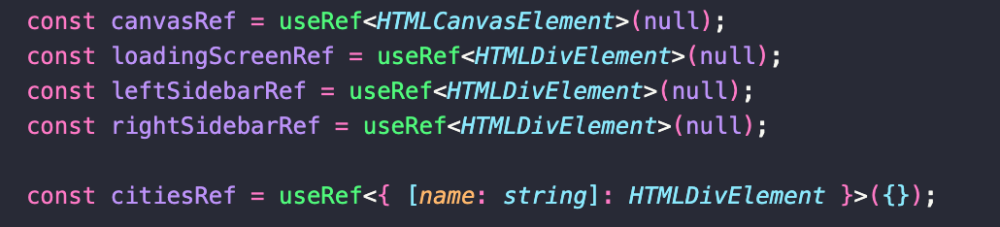

useState เก็บ 2 states คือ
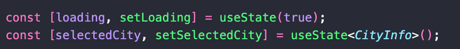

- loading สำหรับการ load 3D space ซึ่งเหตุผลที่ต้องเก็บเป็น state และต้องมี loading screen จะกล่าวอีกที

- selectedCity เป็นการเก็บ city data ที่ถูก selected บน map เพื่อโชว์รายละเอียดบน overlay

useEffect 2 ตัว ตัวแรกไม่มี dependencies คือจะทำงานเมื่อ component นี้ถูก render ข้างในจะเป็น logic ของ Three.js
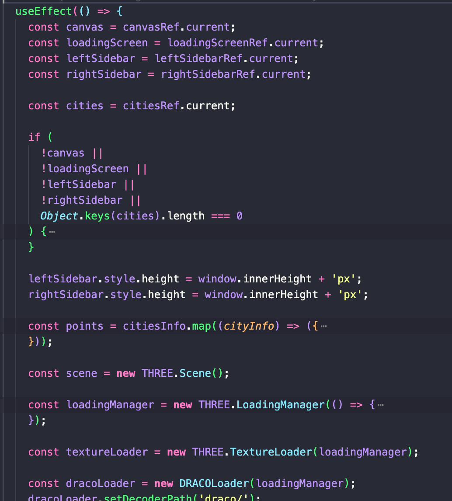
ตัวที่สองจะ trigger เมื่อ selectedCity เปลี่ยนโดยมี logic เกี่ยวกับแสดงรายละเอียดของ city data บน overlay
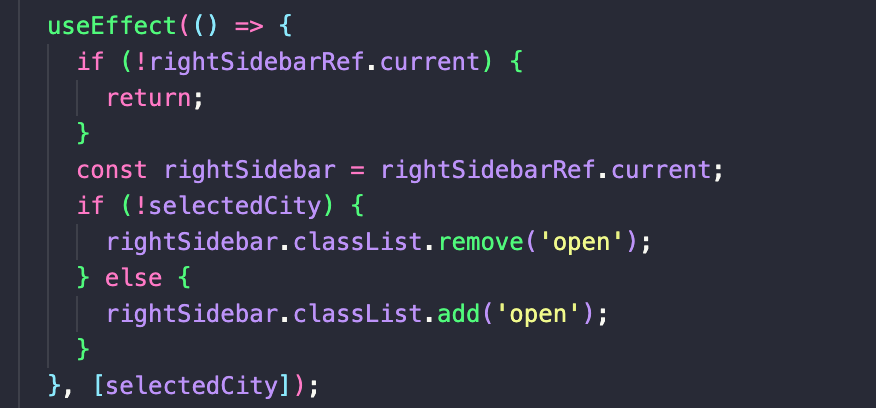

(ทั้งสองตัวจะกล่าวถึง logic โดยละเอียดอีกที)

สุดท้ายคือส่วน render
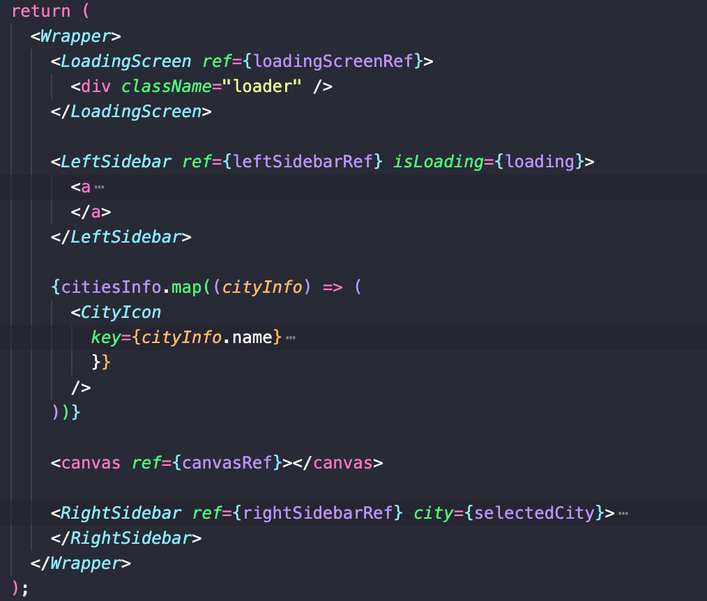

ส่วนที่เป็นถูกวาด 3D space ลงไปด้วย Three.js คือ `<canvas ...>` โดยมีการ assign ref เพื่อให้ Three.js access DOM ได้
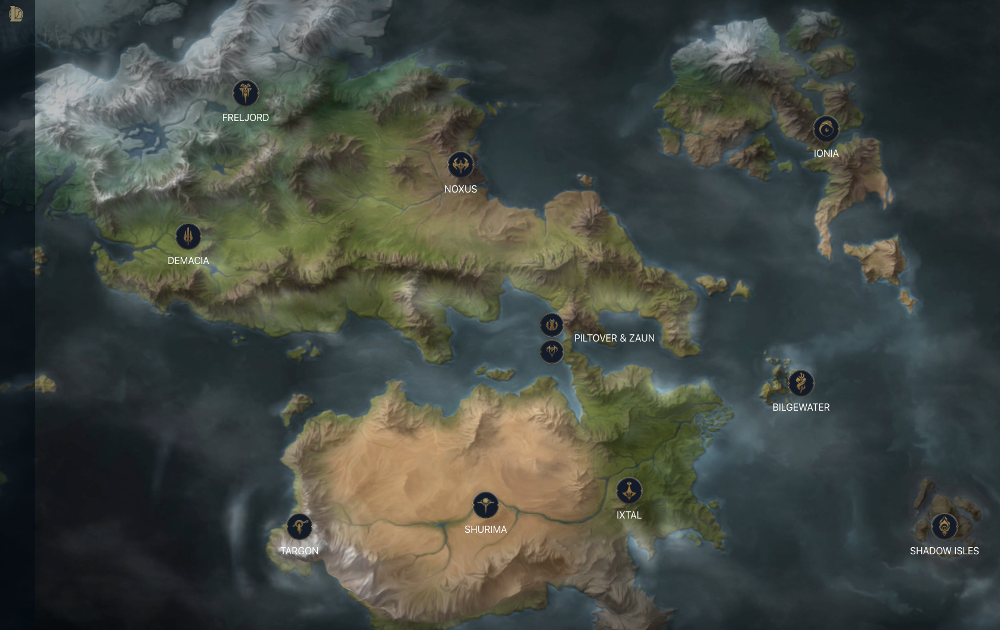
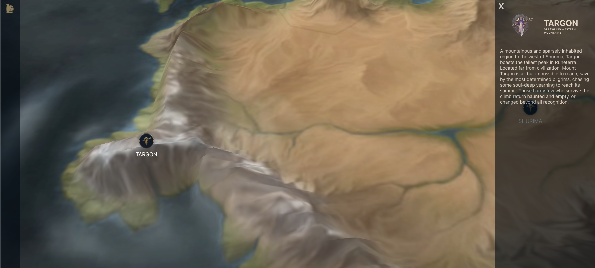

ส่วนอื่นที่เป็น React Component คือ HTML Overlay บน 3D space โดยจะมี

- LoadingScreen หน้า loading ก่อนที่ 3D space จะ load เรียบร้อย
  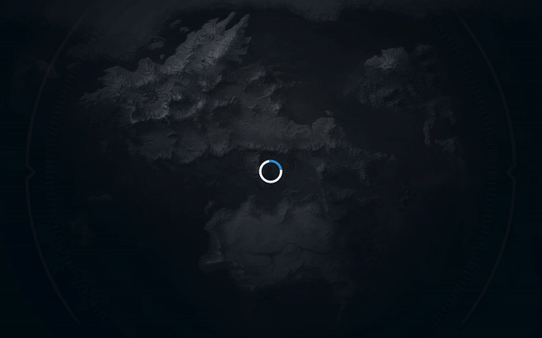
- LeftSidebar overlay แสดง sidebar ทางซ้าย
  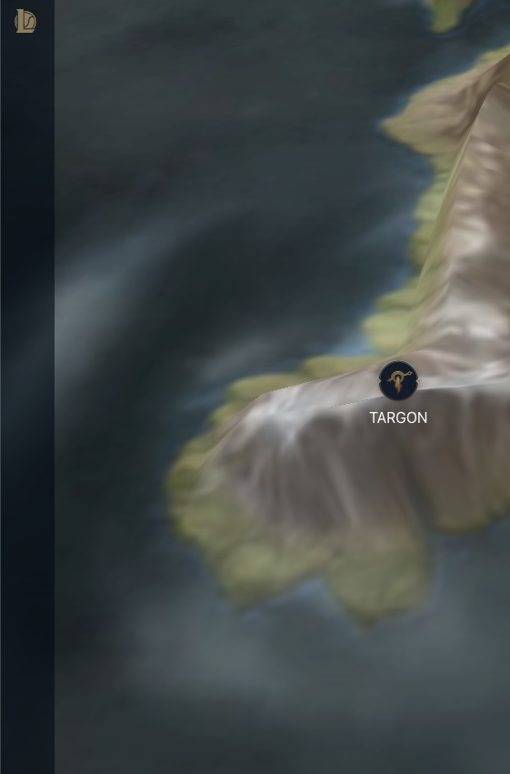
- RightSidebar overlay แสดง sidebar ทางขวาแสดงข้อมูลของ city ที่ถูกเลือก
  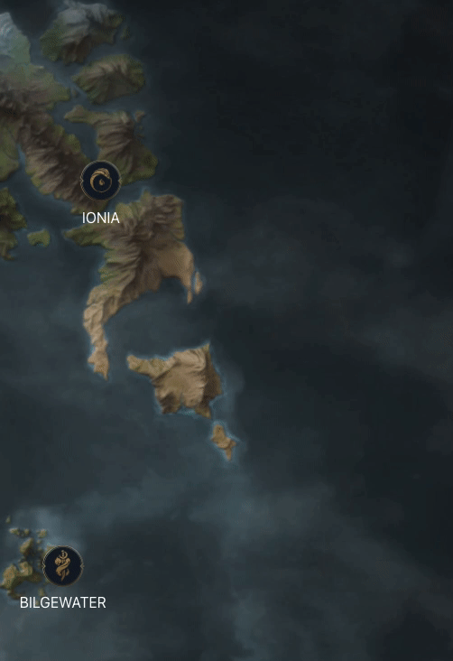

##### Three.js Logic

ใน useEffect อันแรกจะเป็น logic ทั้งหมดของ Three.js ทั้งหมดซึ่งจะถูก execute แค่ครั้งเดียวตอน react component render (คล้าย componentDidMount ใน React Class) เหตุผลคือการ setup logic ของ Three.js ทำครั้งแค่ครั้งเดียวในการ render ของ react และส่วนของการ update แต่ละ frame เช่นการ control ของ camera จะใช้หลักการของการ call ตัวเองในทุกๆ frame ด้วย `window.requestAnimationFrame`
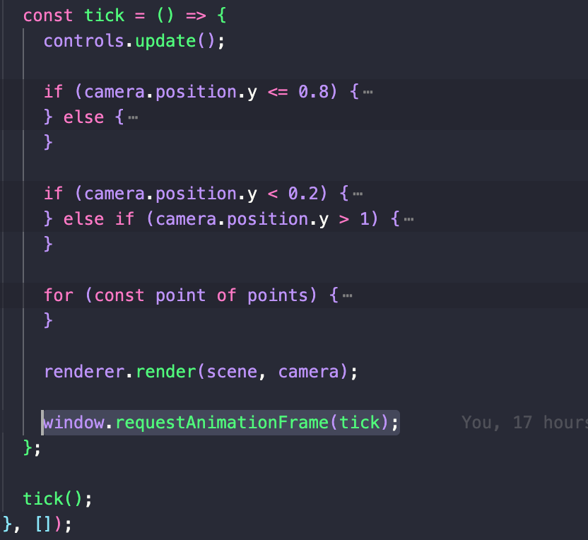

ส่วนแรกของ logic จะเป็นการ access ref ที่มาจาก useRef ที่กล่าวไปข้างต้น
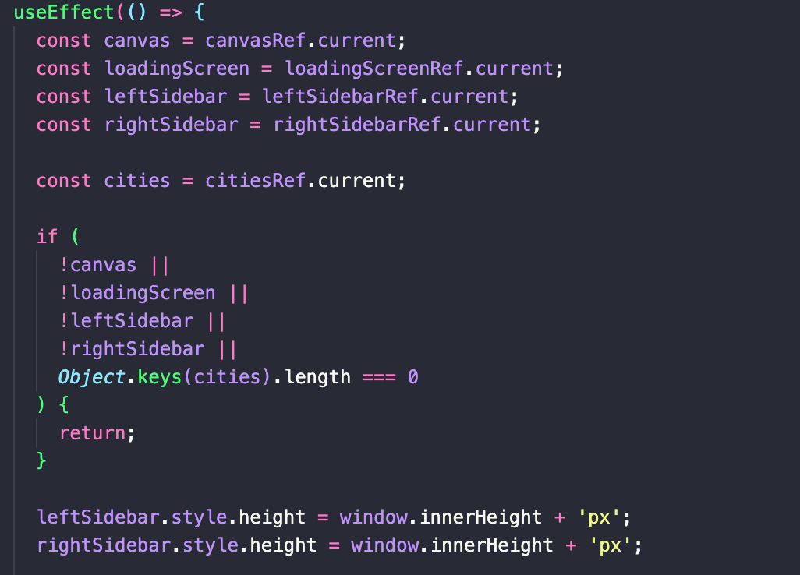

ส่วนของ if block เป็นการเช็ค current ref ว่าต้องมีค่าถึงจะให้ทำงานต่อ เนื่องจาก ref.current ไม่การัณตีว่าจะมีค่า แต่ในกรณีของการเข้า `useEffect(() => {...},[])` ref.current จะมีค่าแน่นอนเพราะผ่านการ render มาแล้ว 1 ที (หลักการของ React) แต่ต้องเช็คอยู่เพื่อเป็น type check (typescript) และส่วนล่างสุดเป็นการ set ให้ sidebar ทั้ง 2 ไม่ overflow viewport (styling)

ส่วนต่อไปคือการเก็บตัวแปร points คือเป็น การ represent จุดเป็น 3D space ที่เราจะเอา HTML Overlay ลงไปวาง เนื่องจาก overlay นั้นอึงกับ viewport ไม่ได้อิงกับ 3D space ถ้าเราต้องการให้ Overlay นั้นเหมือนอยู่บน 3D space เช่นเมื่อ pan camera แล้ว overlay ลอยตาม ต้องมีการ map position และ logic เพิ่มเติม
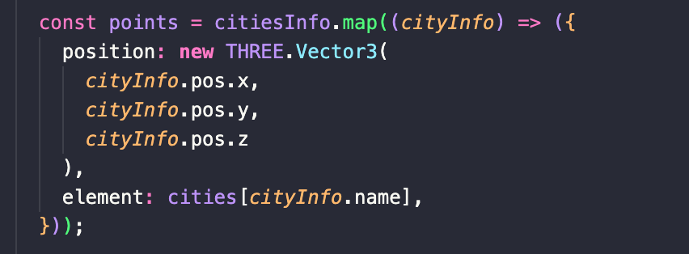


โดยเก็บ 2 ค่าคือ Vector3 represent จุดของ point นั้นบน 3D space และ element คือ ref ไปยัง HTML overlay โดยค่าทั้ง 2 ได้เก็บเป็น data ของ city บน map ตามที่ได้กล่าวไว้ข้างต้น รายละเอียดของแต่ละ city จะมีดังนี้

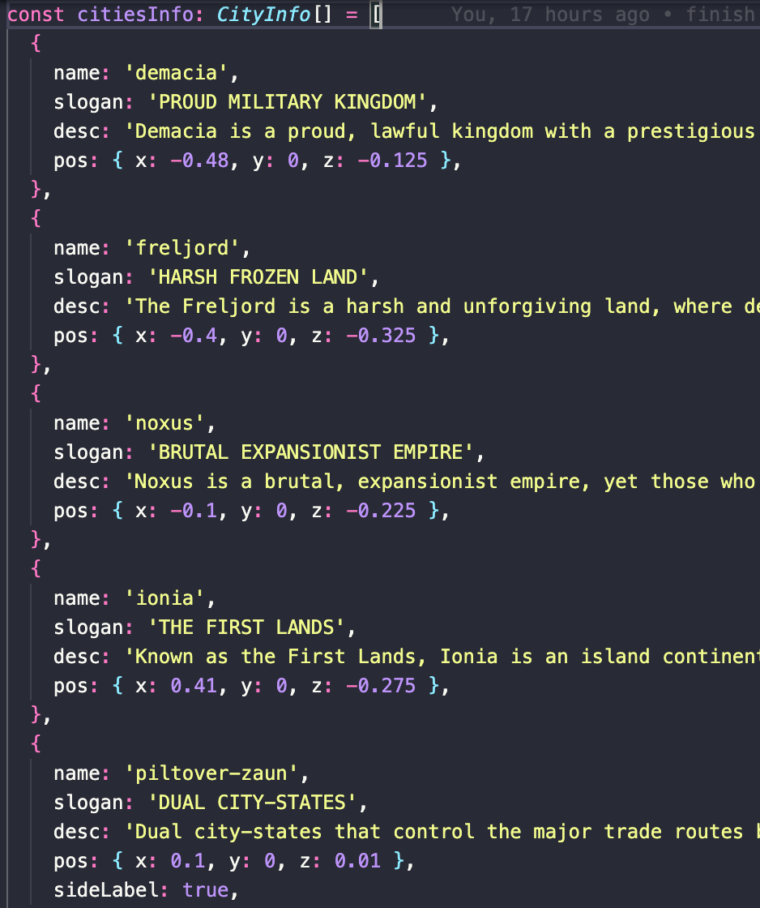

- name ชื่อ city ใช้สำหรับแสดงเป็น label และอ้างอิงถึง icon file ซึ่งเป็นไฟล์ใน public directory ของ react
  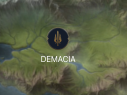 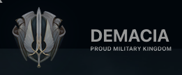
  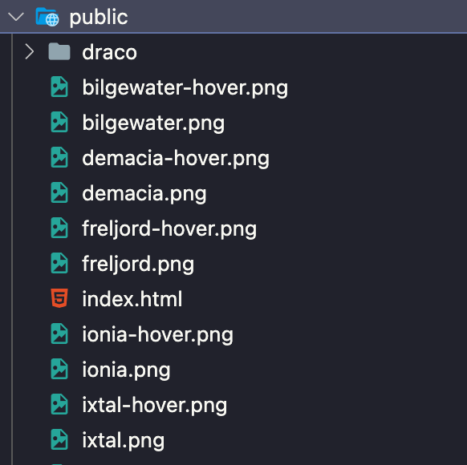
- slogan และ desc แสดงใน RightSidebar
  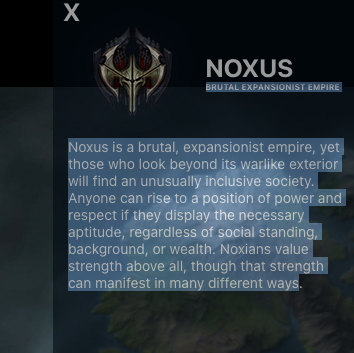
- pos คือ Vector3 represent ตำแหน่งบน 3D space
- sideLabel เป็น optional property สำหรับ Piltover & Zaun city ที่ต้องการแสดง label ด้านข้างแทนด้านล่าง
  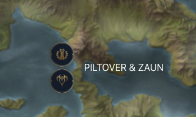

ส่วนต่อไปเป็นส่วนแรกที่เริ่มเรียกใช้ Three.js library
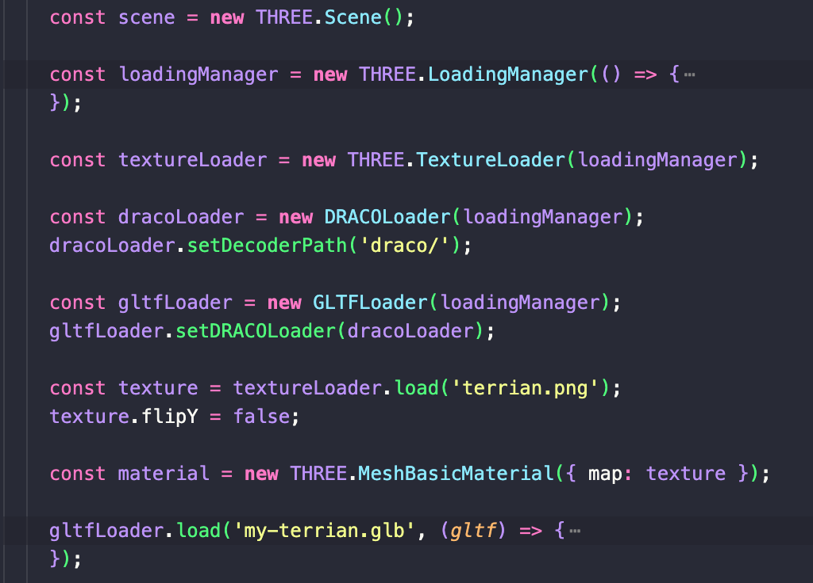

เริ่มจากการ initilize new Three.js scene

ส่วนของ LoadingManager คือการจัดการ load 3D space โดยมี callback function เมื่อ load เสร็จ
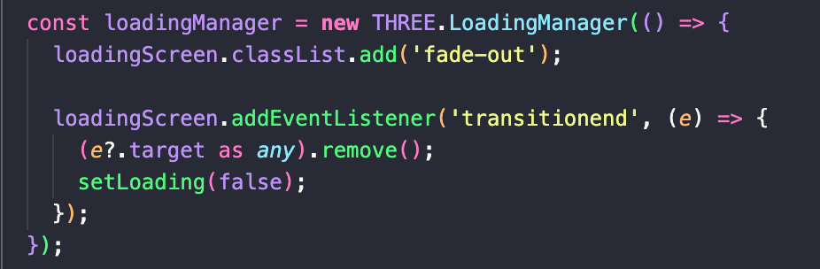
โดย logic ด้านในคือการเอา loadingScreen overlay ออกไปจาก DOM โดยเริ่มจากการ add element class เพื่อ trigger css animation
และ listen event เมื่อ transition เสร็จก็ remove loadingScreen ออกจาก DOM Tree และเสร็จ state loading เป็น false

ซึ่ง state loading นั้นใช้ในการทำ work around ปัญหา Sidebar overlay แสดงออกมาตั้งแต่ loadingScreen เนื่องจาก Overlay ไม่ได้ต้องถูกรอ 3D space load เสร็จก่อน แต่เพื่อความสวยงามจึงใช้การเก็บ state และ set opacity ให้มองไม่เห็นเมื่อยัง load อยู่แทน
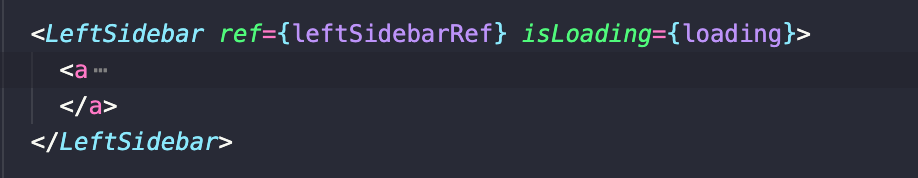
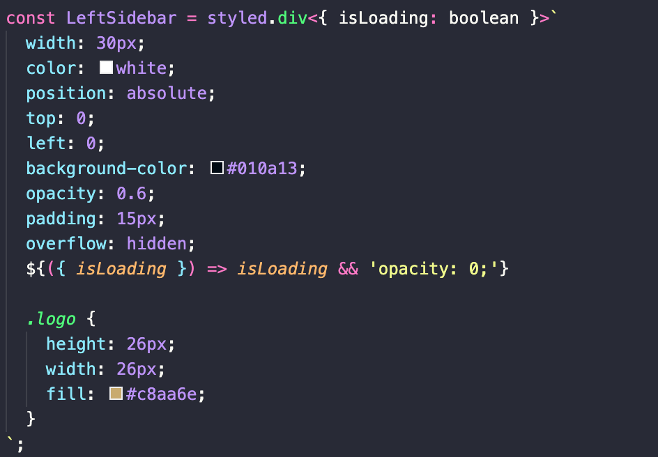

ส่วนของ 3D model loader (mesh & texture)

3D ใน Project นี้คือ terrian นั้นเอง

ตัว terrian นั้นเป็น 3D model มาจาก blender โดยหลักการมาจาก plane ที่มี texture เป็นรูปภาพของ map ของเกม LOL และใช้ sculpt mode ใน blender ในการสร้างความนูนให้ terrian
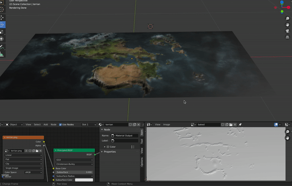
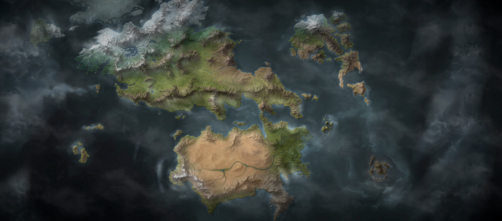

initialize TextureLoader

```
    const textureLoader = new THREE.TextureLoader(loadingManager);
```

เนื่องจากตัว model export เป็นสกุล .glb (gLTF) จึงต้องใช้ DracoLoader และ GLTFLoader

```
    const dracoLoader = new DRACOLoader(loadingManager);
    dracoLoader.setDecoderPath('draco/');

    const gltfLoader = new GLTFLoader(loadingManager);
    gltfLoader.setDRACOLoader(dracoLoader);
```

ทำการ load texture 'terrian.png'
และสั่ง flipY เป็น false (default เป็น true) เนื่องจากใช้ GLTFLoader ทำให้ไม่มีปัญหาของ conflict แกน Y ที่บางที่ + เป็นขึ้น บางที่ + เป็นลง (เนื่องจาก GLTFLoader สามารถ configure texture ได้ถูกต้อง ref: https://threejs.org/docs/index.html#examples/en/loaders/GLTFLoader)

และสร้าง material แบบ basic (MeshBasicMaterial) และใส่ texture เข้าไป

```
    const texture = textureLoader.load('terrian.png');
    texture.flipY = false;

    const material = new THREE.MeshBasicMaterial({ map: texture });
```

สุดท้ายทำการ load model ด้วย gltfLoader และใส่ material ให้กับ model (ในที่นี้ mesh ที่จะถูกใส่ material คือ child ของ scene ใน model เลย tranverse child แล้ว assign material เข้าไป) สุดท้ายคือ add model เข้าไปใน scene ของ Three.js

```
    gltfLoader.load('my-terrian.glb', (gltf) => {
      gltf.scene.traverse((child: any) => {
        child.material = material;
      });
      scene.add(gltf.scene);
    });
```

ส่วนของการ render และการ control
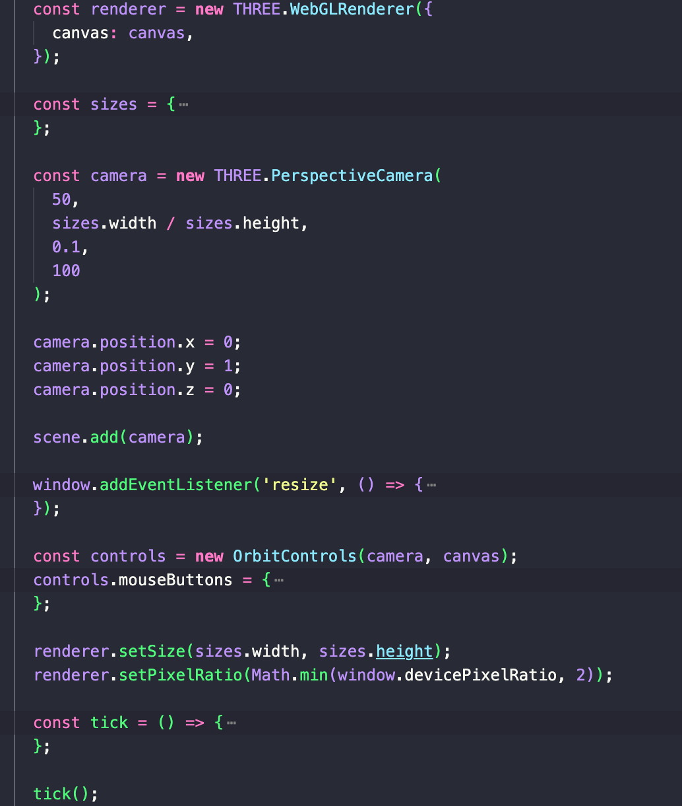

ทำการ initialize new WebGLRenderer และส่ง ref ของ canvas element เข้าไป

```
    const renderer = new THREE.WebGLRenderer({
      canvas: canvas,
    });
```

ทำการสร้างตัวแปร literal object อันนึงขึ้นมาชื่อ sizes เก็บค่าขนาดของ viewport เพื่อใช้ในการคำนวณในส่วนอื่น ๆ

```
const sizes = {
      width: window.innerWidth,
      height: window.innerHeight,
};
```

ส่วนของ camera คือมุมมองที่ user จะเห็นการ render ของ 3D space โดย initialize เป็นแบบ Perspective เพื่อให้เห็น dept ของ 3D (ต่างจาก Orthographic ที่จะไม่เห็น dept)

```
    const camera = new THREE.PerspectiveCamera(
      50,
      sizes.width / sizes.height,
      0.1,
      100
    );

    camera.position.x = 0;
    camera.position.y = 1;
    camera.position.z = 0;

    scene.add(camera);
```

โดยรับ arguments 4 ตัวคือ


- fov ใช้ค่า default ที่ 50
- aspect ration หาได้จากการเอา width / height
- near ใช้ค่า default ที่ 0.1
- far เนื่องจากเราไม่ต้องการ zoom out ใกล้จาก terrian มาก ค่า 100 จึงเพียงพอ

ต่อไปคือ position ของ camera เนื่องจากค่า default อยู่ที่ (0,0,0) และ terrian อยู่ที่ (0,0,0) camara จึงต้องถอยออกมาเพื่อให้เห็น terrian โดยเนื่องจาก terrian วางอยู่ในลักษณะหงายขึ้น และแกน Y ใน Three.js คือแนว verticle จึง set position ของ y ของ camera เป็น 1

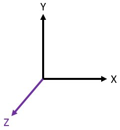
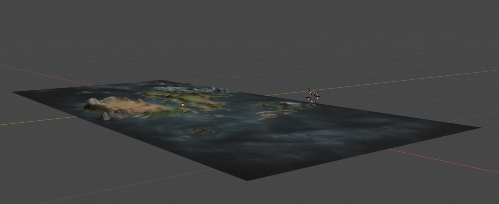

และสุดท้ายคือ add camera เข้า scene ของ Three.js

ส่วนของ resize event listener ส่วนนี้คือ watch event การ resize หน้าต่าง browser และปรับ camera และ renderer ให้ตรง

```
 window.addEventListener('resize', () => {
      sizes.width = window.innerWidth;
      sizes.height = window.innerHeight;

      camera.aspect = sizes.width / sizes.height;
      camera.updateProjectionMatrix();

      renderer.setSize(sizes.width, sizes.height);
      renderer.setPixelRatio(Math.min(window.devicePixelRatio, 2));
    });
```

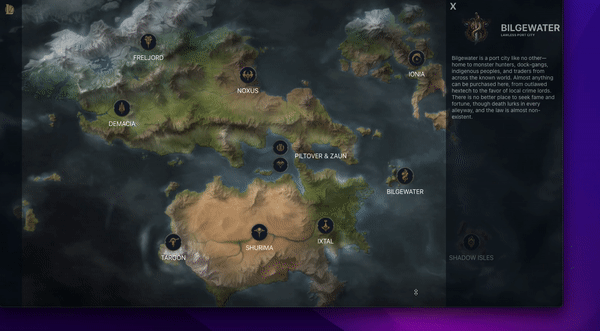

ส่วนของ control คือการควบคุม camera โดยในทีนี้จะใช้ OrbitControls ที่ custom ปุ่มของเมาส์ที่ใช้ควบคุมเพื่อให้ใกล้เคียง reference ที่สุด

```
    const controls = new OrbitControls(camera, canvas);
    controls.mouseButtons = {
      LEFT: THREE.MOUSE.PAN,
      MIDDLE: THREE.MOUSE.DOLLY,
      RIGHT: THREE.MOUSE.PAN,
    };
```

โดยทั้ง left และ right click and hold เป็นการ pan


ลูกกลิ้ง middle mouse เป็นการ zoom

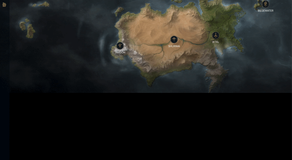

สังเกตุว่าจะไม่มีปุ่มควบคุม rotate เนื่องจากใน case ของ project นี้ไม่ต้องการควบคุมการ rotate ของ camera ด้วยปุ่มใดปุ่มนึงของ mouse แต่จะมีการ rotate ไปพร้อมกับการ zoom เข้า/ออก เพื่อให้เหมือนตาม reference ซึ่ง logic ตรงนี้จะพูดถึงอีกทีในฟังก์ชั่น tick

ส่วนของ renderer

```
    renderer.setSize(sizes.width, sizes.height);
    renderer.setPixelRatio(Math.min(window.devicePixelRatio, 2));
```

จะมีการ set size ซึ่งก็คือ width และ height ของ viewport นั้นเอง
และมีการ set pixel ratio อย่างน้อย 2 หรือตามค่า device เพื่อป้องกันการ blur ของการ render

ส่วนสุดท้ายคือ update function ชื่อ tick ที่จะ called ทุก frame

```
const tick = () => {
      controls.update();

      if (camera.position.y <= 0.8) {
        camera.rotation.x = -Math.PI * 0.5 + (0.8 - camera.position.y);
      } else {
        camera.rotation.x = -Math.PI * 0.5;
      }

      if (camera.position.y < 0.2) {
        camera.position.y = 0.2;
      } else if (camera.position.y > 1) {
        camera.position.y = 1;
      }

      for (const point of points) {
        const screenPosition = point.position.clone();
        screenPosition.project(camera);

        let x = (screenPosition.x * 0.5 + 0.5) * sizes.width;
        let y = (screenPosition.y * -0.5 + 0.5) * sizes.height;

        point.element.style.transform = `translate(-50%, -50%) translate(${x}px,${y}px)`;
      }

      renderer.render(scene, camera);

      window.requestAnimationFrame(tick);
    };

    tick();
```

มีการเรียก

```
controls.update();
```

ในทุก frame เพื่อให้สามารถ control ได้

ส่วนของปรับ rotation และ limit ของ camera

ส่วนแรกคือ logic ในการทำให้ camera rotate ด้วยเวลา zoom ตามตัวอย่างที่เห็นไปข้างต้น

```
      if (camera.position.y <= 0.8) {
        camera.rotation.x = -Math.PI * 0.5 + (0.8 - camera.position.y);
      } else {
        camera.rotation.x = -Math.PI * 0.5;
      }
```

หลักการคือเมื่อ zoom เข้าไปถึงระยะนึง (ในที่นี้คือ y = 0.8) ให้ทำการเริ่ม rotate camera ในแกน x
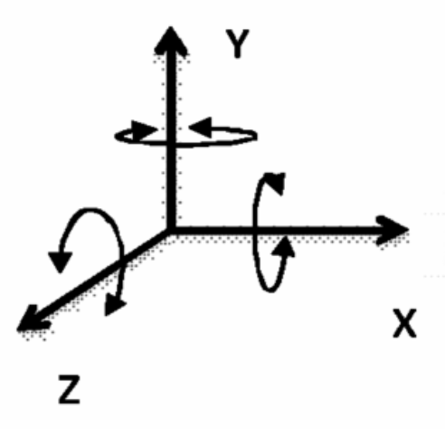

โดย Math.PI _ 0.5 คือ 1/4 รอบ เนื่องจาก rotation คำนวณแบบ euler หน่วย radian โดย 1 รอบคือ Math.PI _ 2 เพราะฉนั้น Math.PI \* 0.5 คือ 1/4 รอบ ส่วน ลบด้านหน้าคือให้หมุนไปในทิศตามเข็มถ้ามองจากทิศตามรูป
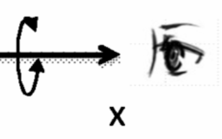

ส่วน + (0.8 - camera.position.y); คือ offset การ rotate ที่เพิ่มขึ้นเรื่อยๆตามสัดส่วนของการ zoom แกน y

ใน else คือจะไม่มี offset คือ camera จะหันหน้าทิ่มลง terrian

อีกส่วนนึงคือเป็น limit ของการ zoom เข้าออกของ camera ไม่ให้เกินระยะที่กำหนด (คนละอันกับ near, far arguments ที่ใส่ไปตอน initiaize camara อันนั้นคือระยะที่ camera มองเห็น ส่วนอันนี้ระยะที่ camara สามารถ zoom เข้าไปได้)

```
      if (camera.position.y < 0.2) {
        camera.position.y = 0.2;
      } else if (camera.position.y > 1) {
        camera.position.y = 1;
      }
```

ส่วนนี้เป็น logic ที่ทำให้ point จาก points ที่กำหนดไปในข้างต้น translate ไปบน viewport ให้เหมือนว่าจุด ๆ นั้น เกาะติดอยู่กับ 3D space เวลา pan หรือ zoom
ref: https://r105.threejsfundamentals.org/threejs/lessons/threejs-align-html-elements-to-3d.html

```
   for (const point of points) {
        const screenPosition = point.position.clone();
        screenPosition.project(camera);

        let x = (screenPosition.x * 0.5 + 0.5) * sizes.width;
        let y = (screenPosition.y * -0.5 + 0.5) * sizes.height;

        point.element.style.transform = `translate(-50%, -50%) translate(${x}px,${y}px)`;
      }
```

โดย clone position ของแต่ละ point ออกมาเพื่อไม่ให้ค่าจริงถูก mutate แล้วเอาค่านั้นมา project กับ camera จะได้ค่า screen coordiate ที่มีค่า x,y อยู่ในช่วง -1 กับ 1 โดยมีทิศตามรูป
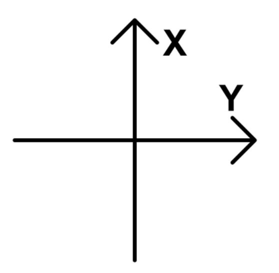

แต่ที่ต้องการไม่ใช่ screen coordiate ระหว่าง -1 กับ 1 แต่เป็นระยะ pixel ตาม CSS coordinates ซึ่ง y จะกลับด้าน
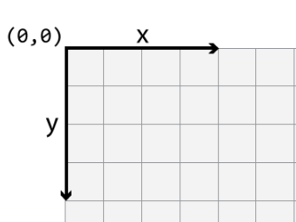

ทำให้ในส่วนของ y ต้องคูณด้วย -1 ไปเพื่อกลับด้าน

และสุดท้ายคือ apply css transform ให้ translate x,y ไปตามค่าที่คำนวณได้

ส่วนสุดท้ายของฟังก์ชั่น tick

```
      renderer.render(scene, camera);

      window.requestAnimationFrame(tick);
```

คือสั่ง render ในทุก ๆ frame และ call ตัวเองใน frame ถัดไป

##### useEffect Logic เมื่อ selectedCity เปลี่ยน

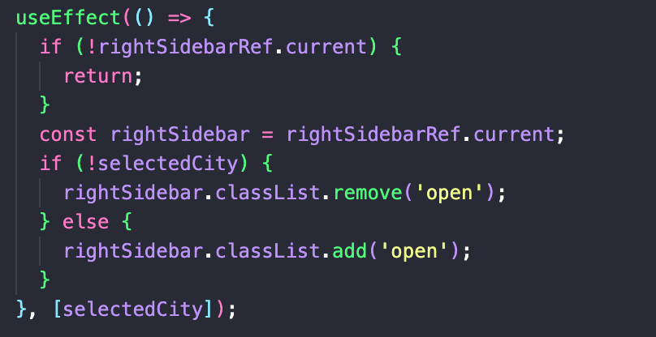

ส่วนนี้จะเป็นการ trigger slide in CSS Animation โดยการ add class open ให้ RightSidebar โดย logic ของการ set selectedCity state จะอยู่กับ CityIcon component

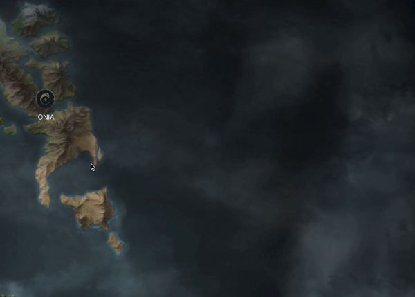

### CityIcon Component

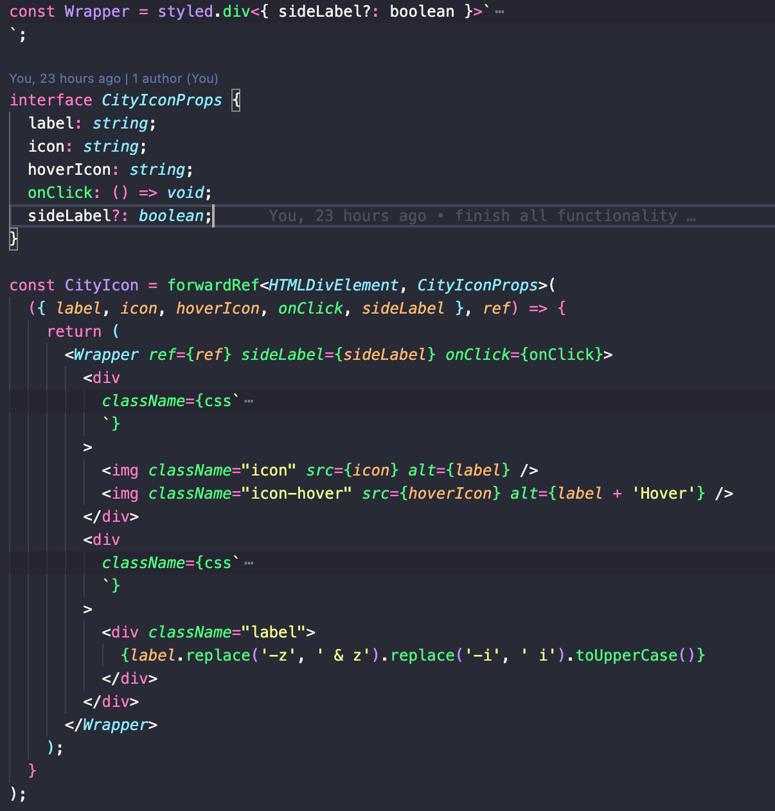

ใน CityIcon.tsx (components/CityIcon.tsx) จะ render ส่วนของ icon city และ label city

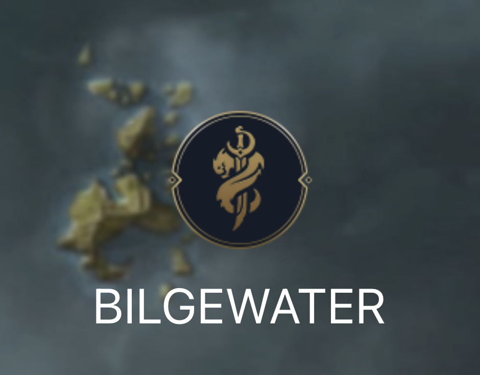

โดย icon จะมี version ปกติและ version hover เมื่อเอา cursor ไปวางทับ

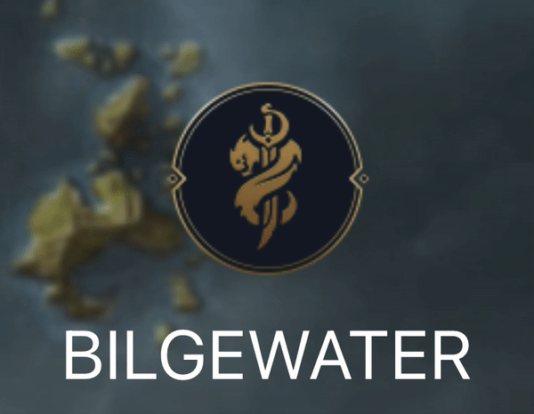

โดยจะรับ props ดังนี้

```
interface CityIconProps {
  label: string;
  icon: string;
  hoverIcon: string;
  onClick: () => void;
  sideLabel?: boolean;
}
```

- label คือ string สำหรับแสดง label ด้านล่างหรือด้านข้าง icon
- icon คือ string ชื่อไฟล์รูป icon ที่อยู่ใน public folder
- hoverIcon คือ string ชื่อรูป icon เวอร์ชั่น hover ที่อยู่ใน public folder
- onClick คือ callback function เมื่อตัว component ถูก click
- sideLabel คือ boolean บอกว่าให้แสดง label ด้านข้างแทนด้านล่างดังตัวอย่างที่เคยกล่าวไปข้างต้น

โดย CityIcon จะถูกเรียกจาก Map components โดยเป็นการ map จาก array data ของ citiesInfo แล้วส่ง props มาดังนี้

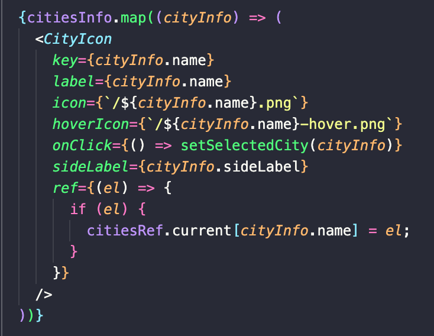

จะเห็นว่า name ของ cityInfo จะถูกเอามาใช้เป็นชื่อไฟล์ของ icon ด้วย และ onClick จะเป็นการ setState selectedCity โดยส่ง cityInfo ทั้งก้อนเข้าไปเพื่อใช้แสดงใน RightSidebar
